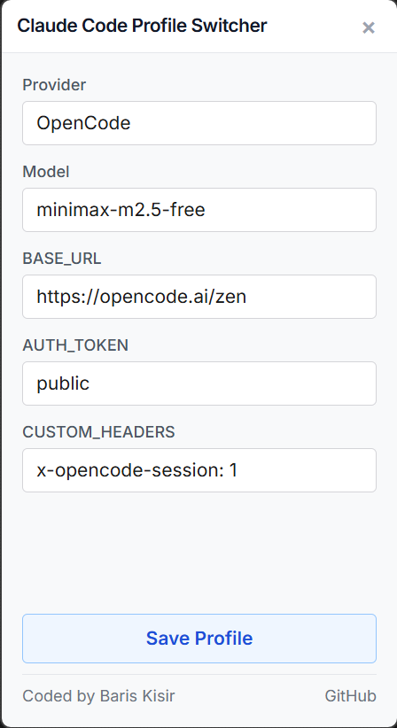

# Claude Code Profile Switcher

[](https://www.npmjs.com/package/claude-code-profile-switcher)

A lightweight, desktop application designed to easily manage and switch your Claude Code environment variables.



## Installation & Usage

```bash
npm install -g claude-code-profile-switcher
claude-code-profile-switcher
```

## CLI Options

- `-h, --help`: Show help information
- `-V, --version`: Show version information

## Features

* Fast, tiny footprint with a compact, frameless retro UI.
* Auto-detects and populates your currently active OS environment variables on startup.
* **Profiles are saved**: Your selected API keys, base URLs, and custom headers are securely saved locally for quick access.
* **Dynamic Model Fetching**: Fetches the latest models directly from your provider's API.

## License

This project is open-source and available under the [MIT License](LICENSE).